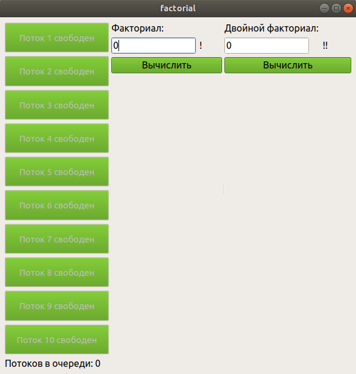

# Описание
GUI приложение, для вычисления факториала и двойного факториала.
<p align="center">
</p>

## Поддерживаемые платформы
* Linux 
  * Среда разработки Qt Creator

## Требования:
* cmake
* qt5-qmake
* boost (не ниже версии 1.56)

## Загрузка, установка и запуск
Установку можно выполнить 2 способами:
* cmake
* qmake

### Загрузка 
```
git clone https://gitlab.com/cplusplusprojects/factorial.git
cd factorial/
```

### Установка с помощью cmake
```
cmake CMakeLists.txt
make
```
### Установка с помощью qmake
```
qmake factorial.pro
make
```
### Запуск
```
cd bin/
./factorial
```

### ITask
- ```void run()``` – выполнение задания;
- ```void cancel()``` – отмена задания;
- ```bool status()``` – текущее состояние задания.
Все потоки ITask, хранятся в ITaskControl.

### ITaskControl
Пул потоков из ITask
- ```void createTask(task, i)``` - создание задачи, где task - задача, i - номер задачи в пуле;
- ```void cancel(index)``` – аналогичный по смыслу одноимённому методу из интерфейса ITask, i - номер задачи в пуле;
- ```std::vector<Status> statuses()``` – текущие состояния заданий в пуле.

### MainWindow
- ```void taskEnded()``` - завершение/отмена задания.

Созданные задания начинают выполняться сразу же после их создания, если в пуле есть свободные потоки, либо ставятся в очередь, если все потоки заняты. Кол-во потоков в пуле: 10.

